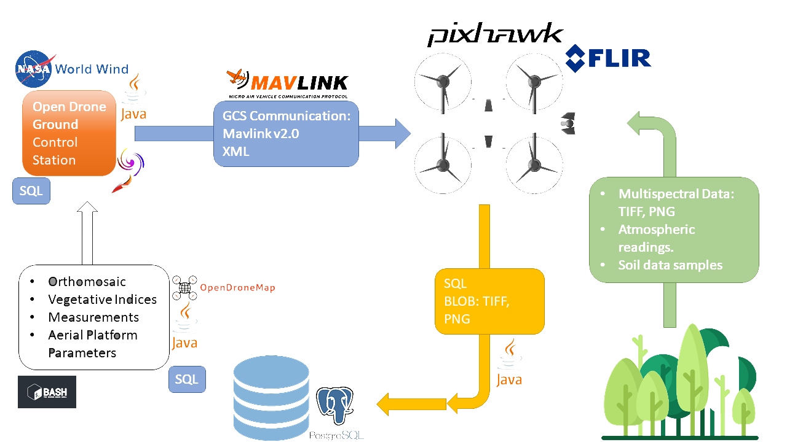

# open-drone
A collective repo linking all relevant repositories to get started building open drones.

## The Open Drone Project
### THE CHALLENGE

The drone has presented itself as a ubiquitous tool for transformative change, from taking aerial photos to delivering much needed supplies including medical supplies and food. Wielding this tool, we can leverage high precision images in various light/electromagnetic spectrum to deduce patterns of interest in crops, the atmosphere, soil and water ecosystems. By so doing, we can identify threats to these precious ecosystems and safeguard them against degradation.

### THE SOLUTION

We have come up with a simple to build and assemble aerial platform that can be used for persistent monitoring to ensure patterns are deduced early and that they can lead to forecasting future threats. Upon capturing patterns of interest, data is stored in a retrieval system to build a data warehouse which will eventually be used to train neural networks/machine learning to deduce patterns and make forecasts.

### WHY OPEN HARDWARE AND SOFTWARE?

Using an open ecosystem will ensure continued evolution of the product through public participation and peer review, as well as ensure rollout of the solution to as many countries as possible. Our idea of the future is being able to forecast carbon sequestration and related issues threatening delicate ecosystems from climate change. We cannot do it alone!

## SOLUTION ARCHITECTURE

### Technology Stack
The Open Drone Suite is build using the Java Programming Language, employs shell scripting as a joiner to various components, as shall be seen in the following documentation.
The image below shows the major components and how they relate to each other. Each technology used is shown alongside to be able to understand how the components interconnect.

#### Overview of the System
The following is a breakdown of each subsystem/component:
There are 3 major components to the Open Drone Suite:
a) The Frontend, comprising the user interface that drives the entire project suite
b) The backend, comprising the mechanisms through which data is stored, and through which data is processed into useful/meaningful information.
d) The hardware stack, comprising the aerial system through which data is acquired using sensors on board the platform.

#### The Front End
Update coming
#### The Backend
Update coming
#### The Hardware Stack
Update coming

### Installation and Usage Guide

#### GETTING STARTED

Head on to our repositories for a breakdown of how to get started.

To build a drone using our designs, review the read me instructions at: https://github.com/team-asr/od-CAD: Repository for Open Drone CAD files

For some sample photos of what we've thus far collected, please head to: https://github.com/team-asr/od-DATA: Repository for Open Drone Data, including aerial imagery and analytics 

For the latest on the software and algorithms we are working on, please head to: https://github.com/team-asr/od-GCS: Repository for Open Drone Ground Control Station (github.com)

### Contribution Guide
The Open Drone Suite is an open source project that can be forked or downloaded directly for use without addition. If you wish to make changes for your own purpose, feel free to fork the projects relating to what to you want to do.
You can directly add to the project by requesting access to directly push changes to the project by contacting the maintaince members. Their contacts are listed at the license section of this document.
This project is continually being updated and more information regarding how to push changes to the master will be included here once mode of ensuring changes do not affect the current work have been identified. In the meantime
it is possible to fork or clone the project and get started. A video is also being made to show how to install, run, and work on the code. You can use an IDE of your choice or use Notepad++ as we do.

#### LICENSES

Our work is licensed under open standards, and each repository lists licenses associated with it. You are welcome to copy, amend, distribute the software, install it, or build your drone. Feel free to reach out to us in the event you require support to setup your own open drone.

Licenses include:

GNU General Public License
Creative Commons Attribution 4.0 (CC-BY-4.0) License
THE TEAM

The Open Drone Project is in active development and maintained by the following team members:

Moses gichangA, Founder & Lead Engineer.
gichanga[at]as-research.org

Samuel Muniu, Implementation Lead, Soil & Environment Engineer.
monio[at]as-research.org
